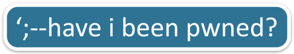

<p align="center">
  <a href="https://github.com/HaveIBeenPwned/PwnedPasswordsAzureFunction">
    
  </a>

  <h1 align="center">Pwned Passwords - Azure Function</h1>
	
  <p align="center">
  <a href="LICENSE" alt="License">
    </a>
  <a href="https://github.com/HaveIBeenPwned/PwnedPasswordsAzureFunction/graphs/contributors" alt="Contributors">
    </a>
  <a href="https://github.com/HaveIBeenPwned/PwnedPasswordsAzureFunction/pulls?q=is%3Apr+is%3Aclosed" alt="Closed PRs">
    </a>
  <a href="https://github.com/HaveIBeenPwned/PwnedPasswordsAzureFunction/network/members/" alt="Forks">
		</a>
  <a href="https://github.com/HaveIBeenPwned/PwnedPasswordsAzureFunction/stargazers/" alt="Stars">
		</a>
  <a href="code_of_conduct.md" alt="Stars">
	</a>
  
  </p>
  <p align="center">
    APIs for the k-anonymity Pwned Passwords implementation
    <br />
    <a href="https://haveibeenpwned.com/Passwords">Visit Pwned Passwords</a>
    ·
    <a href="https://haveibeenpwned.com/API/v3#PwnedPasswords">View Pwned Passwords API</a>
    ·
    <a href="https://github.com/HaveIBeenPwned/PwnedPasswordsAzureFunction/issues/new?labels=bug">Report an Issue</a>
  </p>
</p>

## Contents
- [About](#about-pwned-passwords-%2D-azure-function)
- [Contributing](#getting-started-with-contributions)
  - [Prerequisites](#prerequisites)
  - [Running Locally](#running-locally)
- [To-Do List](#to%2Ddo-list)
- [License](#license)

## Give a Star! :star:
If you like the project, please consider giving it a star to raise awareness!

## About Pwned Passwords - Azure Function

This repository holds the code for the Pwned Passwords Azure Function - the web endpoint which interacts directly with the Azure Blob Storage to retrieve the SHA-1 hashes of the Pwned Passwords using a fixed five-length SHA-1 prefix to anonymise requests. For more details such as the k-anonymity model and Pwned Passwords, view Troy Hunt's blog post [here](https://www.troyhunt.com/ive-just-launched-pwned-passwords-version-2/). The Pwned Passwords Cloudflare Worker can be found [here](https://github.com/HaveIBeenPwned/PwnedPasswordsCloudflareWorker). 

## Getting Started with Contributions

Any and all are welcome to contribute to this project.
Please ensure that you read our [Code of Conduct](/CODE_OF_CONDUCT.md) first.

### Prerequisites

It is recommended to use [Visual Studio 2019](https://visualstudio.microsoft.com/downloads/) or [VS Code](https://code.visualstudio.com/) for working on Pwned Passwords Azure Function. You will also need the [.Net Framework 4.6.2 Developer Pack](https://dotnet.microsoft.com/download/dotnet-framework/net462) installed.

Once you have installed your IDE of choice, make sure that you install the relevant Azure Functions extensions.

- For VS Code, use the VS Code [Azure Functions](https://marketplace.visualstudio.com/items?itemName=ms-azuretools.vscode-azurefunctions) extension
- For Visual Studio 2019, make sure you have installed the [Azure Development workload](https://docs.microsoft.com/en-us/azure/azure-functions/functions-create-your-first-function-visual-studio#prerequisites). If you haven't, use the Visual Studio Installer to do so (instructions on this can be found [here](https://docs.microsoft.com/en-us/dotnet/azure/configure-visual-studio)).

[Azure Storage Emulator](https://docs.microsoft.com/en-us/azure/storage/common/storage-use-emulator) will also be needed for local emulation of Azure Blob Storage.

### Running Locally

You should configure a `local.settings.json` file to hold the Configuration Manager values for `PwnedPasswordsConnectionString` and `BlobContainerName` within the Functions project. Ensure that this file is **not** commited (it is ignored by Git within the Functions project). 

`local.settings.json` should contain the following correctly configured values:

```json
{
    "IsEncrypted": false,
    "Values": {
        "PwnedPasswordsConnectionString": "<Your Connection String from Azure Storage Emulator>",
        "BlobContainerName": "<Name of Blob Container You Created>"
    }
}
```

Using a utility such as cURL or a web browser will allow you to visit the locally running Azure Functions endpoints, typically at `http://localhost:7071`. 

## To-Do List

- [ ] Authenticated Endpoint which can receive SHA-1/NTLM/prevalence data
- [ ] Extract SHA-1 into Azure Blob Storage - either appending in order to file or updating count value
- [ ] Add SHA-1/NTLM hashes to downloadable corpus - this should be updated monthly
- [ ] Corresponding Cloudflare cache item for corpus or blob storage file must be invalidated - this shouldn't be more than once per day for a cache item

The whole premise around open sourcing the Pwned Passwords Azure Function is to foster further development on the Pwned Passwords project. This To-Do list has been taken from the [announcement blog post open-sourcing Pwned Passwords](https://www.troyhunt.com/pwned-passwords-open-source-in-the-dot-net-foundation-and-working-with-the-fbi/).

> 1. There's an authenticated endpoint that'll receive SHA-1 and NTLM hash pairs of passwords. The hash pair will also be accompanied by a prevalence indicating how many times it has been seen in the corpus that led to its disclosure. As indicated earlier, volumes will inevitably fluctuate and I've no idea what they'll look like, especially over the longer term.
> 2. Upon receipt of the passwords, the SHA-1 hashes need to be extracted into the existing Azure Blob Storage construct. This is nothing more than 16^5 different text files (because each SHA-1 hash is queried by a 5 character prefix), each containing the 35 byte SHA-1 hash suffix of each password previously seen and the number of times it's been seen.
> 3. "Extracted into" means either adding a new SHA-1 hash and its prevalence or updating the prevalence where the hash has been seen before.
> 4. Both the SHA-1 and NTLM hashes must be added to a downloadable corpus of data for use offline and as per the previous point, this will mean creating some new entries and updating the counts on existing entries. Due to the potential frequency of new passwords and the size of the downloadable corpuses (up to 12.5GB zipped at present), my thinking is to make this a monthly process.
> 5. After either the file in blob storage or the entire downloadable corpus is modified, the corresponding Cloudflare cache item must be invalidated. This is going to impact the cache hit ratio which then impacts performance and the cost of the services on the origin at Azure. We may need to limit the impact of this by defining a rate at which cache invalidation can occur (i.e. not more than once per day for any given cache item).

## Maintainers

This repository is currently maintained by [@TroyHunt](https://github.com/troyhunt). 

## License

This project has been released under the BSD 3-clause license. More information can be found by viewing the license [here](LICENSE).